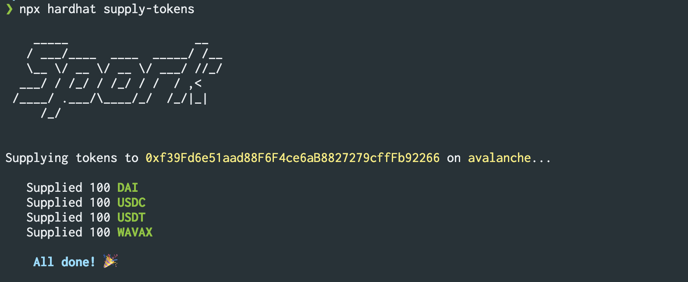

       _____                  __  
      / ___/____  ____  _____/ /__
      \__ \/ __ \/ __ \/ ___/ //_/
     ___/ / /_/ / /_/ / /  / ,<   
    /____/ .___/\____/_/  /_/|_|  
        /_/                      

---

Spork is an Ethereum network forking tool, built on top of [Hardhat](https://github.com/nomiclabs/hardhat). It allows for forking of EVM-compatible chains and has CLI commands for funding account addresses with both ERC20 tokens and native assets. Spork shines best when with frontend web3 applications where a variety of tokens are necessary for properly testing UI/UX interactions.

## Installation 

To install Spork, first clone the project: 

```
git clone git@github.com:greenwood-finance/spork.git
```

Then, enter the `/spork` folder and run:

```
npm install
```

## Setup
Before running any commands, you will need an [Infura API key](https://www.infura.io/) and you will need to specify the network to run spork on.

To set the environment variables, create a `.env` file and add: 

`INFURA_API_KEY=XXXXXXXXXXX`

`NETWORK=mainnet`

Current supported networks for the `NETWORK` environment variable are:
- `mainnet`
- `arbitrum`
- `avalanche`

Or, you can export the variables in the command line: 

`export INFURA_API_KEY=XXXXXXXXXXX`

`export NETWORK=mainnet`


## Usage

To run the forked node:

```
npx hardhat node
```

Then, in a new terminal tab or window, provide an address to supply with tokens:

```
npx hardhat supply-tokens --account your_EOA_here
```

To supply an address with native tokens:

```
npx hardhat supply-native --account your_EOA_here
```

## Adding a token
To add a token, go to `/src/utils/addresses.ts` and a new token mapping.

Be sure to include these fields:
- `address`: token address (for all supported chains)
- `whale`: address of a larger bag-holder of the token (for all supported chains)
- `decimals`: number of decimals the token has
- `symbol`: token symbol

**Note**: whale addresses do not need to have a native token balance.

## Example



